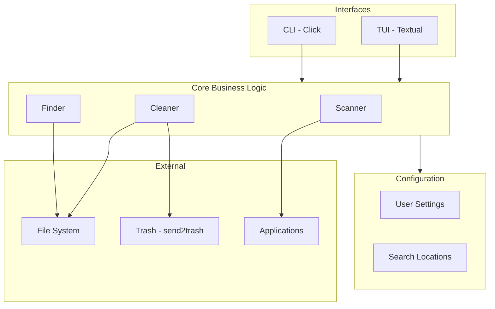
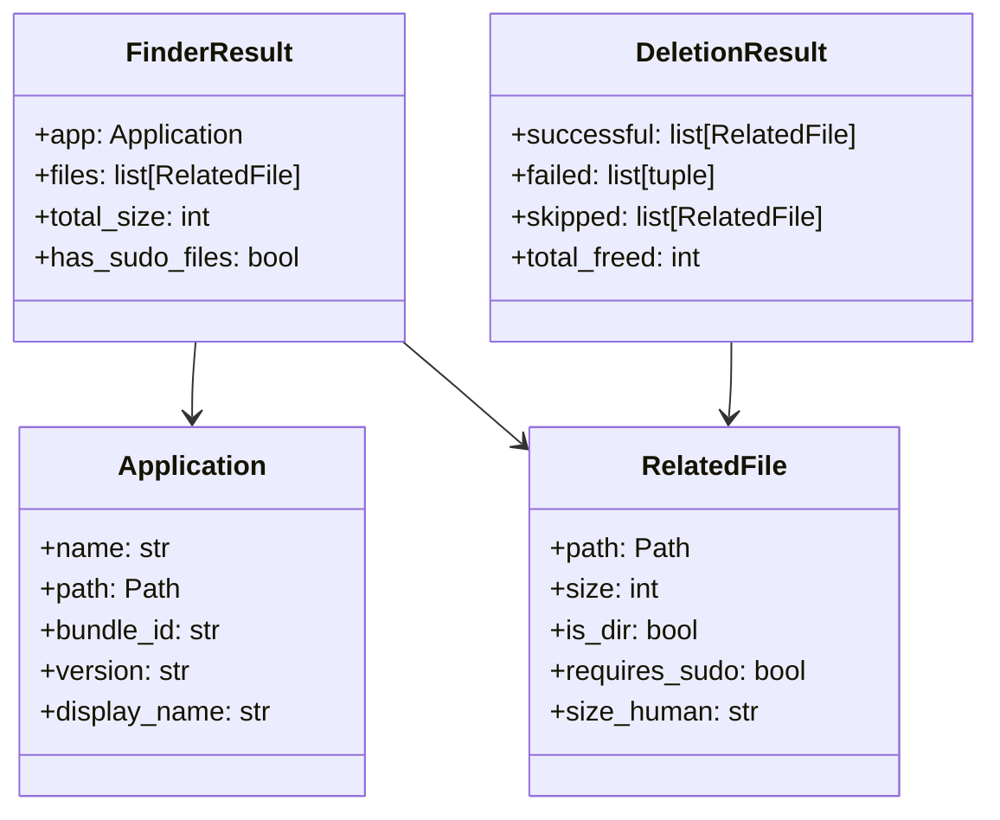
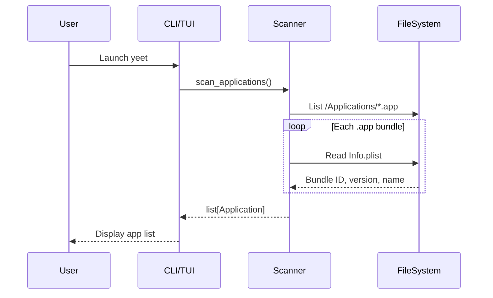
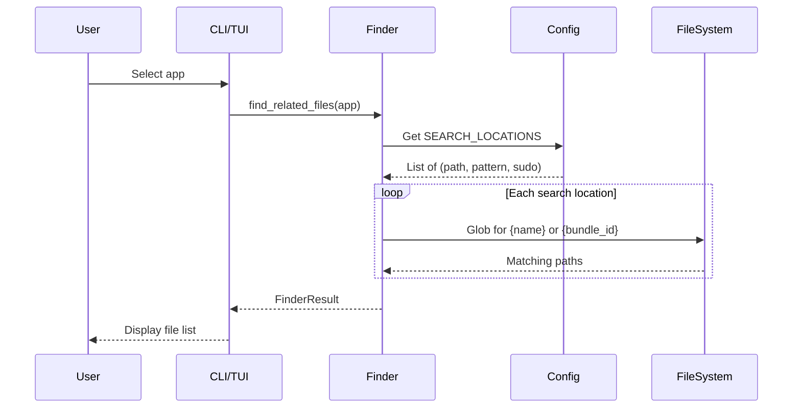
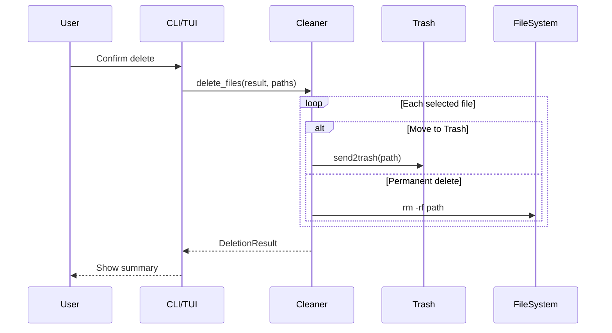
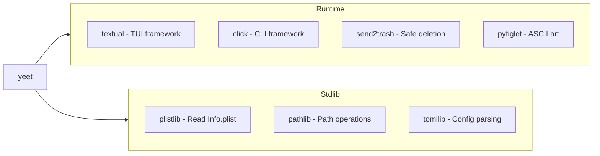

# Architecture

This document describes the architecture of **yeet**, a macOS application cleaner.

## Overview

yeet is a Python application with two interfaces:
- **CLI** - Command-line interface for scripting and quick operations
- **TUI** - Terminal User Interface for interactive use



## Directory Structure

```
src/yeet/
├── __init__.py          # Package version
├── __main__.py          # Entry point
├── cli/                 # Command-line interface
│   ├── __init__.py
│   └── banner.py        # ASCII art banner
├── config/              # Configuration
│   ├── __init__.py      # Re-exports
│   ├── settings.py      # User config, themes
│   └── locations.py     # Search paths
├── core/                # Business logic
│   ├── __init__.py      # Re-exports
│   ├── models.py        # Data classes
│   ├── scanner.py       # App discovery
│   ├── finder.py        # Related file finder
│   └── cleaner.py       # File deletion
└── tui/                 # Terminal UI
    ├── __init__.py
    ├── app.py           # Main Textual app
    ├── screens.py       # Modal dialogs
    ├── widgets.py       # Custom widgets
    └── styles.tcss      # CSS styles
```

## Module Responsibilities

### Core Layer



| Module | Responsibility |
|--------|---------------|
| `models.py` | Data classes: `Application`, `RelatedFile`, `FinderResult`, `DeletionResult` |
| `scanner.py` | Discover installed apps from `/Applications`, extract bundle info from `Info.plist` |
| `finder.py` | Search Library directories for files matching app name or bundle ID |
| `cleaner.py` | Delete files (move to Trash or permanent), quit running apps |

### Config Layer

| Module | Responsibility |
|--------|---------------|
| `settings.py` | Load user config from `~/.config/yeet/config.toml`, theme definitions |
| `locations.py` | Define search paths in `~/Library` and `/Library` |

### CLI Layer

| Module | Responsibility |
|--------|---------------|
| `banner.py` | Generate random ASCII art banners using pyfiglet |
| `__main__.py` | Click command definitions, argument parsing |

### TUI Layer

| Module | Responsibility |
|--------|---------------|
| `app.py` | Main Textual application, keyboard bindings, state management |
| `screens.py` | Modal screens: `ConfirmScreen`, `ResultScreen` |
| `widgets.py` | List item widgets: `AppListItem`, `FileListItem` |
| `styles.tcss` | Textual CSS for layout and theming |

## Data Flow

### App Discovery Flow



### File Finding Flow



### Deletion Flow



## Configuration

### Config File Locations

Checked in order:
1. `~/.config/yeet/config.toml`
2. `~/.yeetrc`

### Config Schema

```toml
[appearance]
theme = "default"  # default, dracula, nord, catppuccin, gruvbox, light

[appearance.colors]  # Optional overrides
primary = "#7C3AED"

[behavior]
confirm_delete = true
default_permanent = false
include_system_apps = false
scan_system_locations = false
```

## Search Locations

yeet searches these directories for app-related files:

### User Library (`~/Library/`)
- Application Support
- Caches
- Preferences (`.plist` files)
- Logs
- Containers
- Group Containers
- Saved Application State
- LaunchAgents
- Cookies
- WebKit
- HTTPStorages
- Application Scripts

### System Library (`/Library/`) - requires sudo
- Application Support
- Caches
- Preferences
- LaunchAgents
- LaunchDaemons
- Logs

## Dependencies



## Error Handling

- **Permission errors**: Files requiring sudo are marked and skipped by default
- **Running apps**: User is prompted to quit before deletion
- **Invalid config**: Falls back to defaults silently
- **Missing files**: Treated as successful (already deleted)

## Extension Points

### Adding Search Locations
Edit `config/locations.py` to add new patterns:
```python
SEARCH_LOCATIONS.append(
    (Path.home() / "Library" / "NewLocation", "{bundle_id}", False)
)
```

### Adding Themes
Edit `config/settings.py` to add to `THEMES` dict:
```python
THEMES["mytheme"] = {
    "primary": "#...",
    # ...
}
```

### Adding CLI Commands
Extend `__main__.py` with new Click options or create subcommands.
